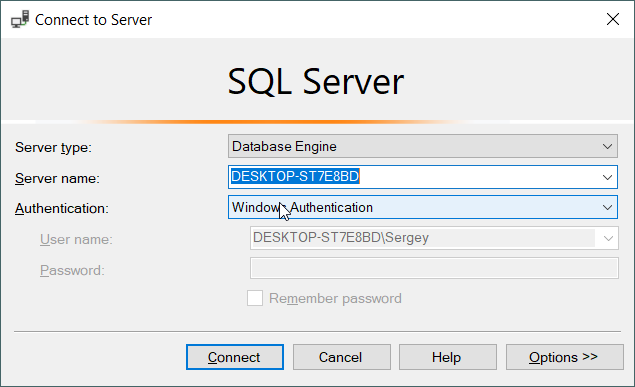

# Database installation instruction

1. Install SQL Server Developer Edition Installer (if you don't have one) with MIXED MODE AUTHENTICATION
    1. Go to [download link](https://www.microsoft.com/ru-ru/sql-server/sql-server-downloads)
    2. Choose Developer Edition
       
    2. Open the installer ()
    3. Click "Custom" 
    4. Click "Install". Do not mind current path -- it is the path where only installation files are stored, not an actual SQL Server 
    5. Wait for installer to download files
    6. Click "Installation" and then "New SQL ..." 
    7. Click "Next" 
    8. Accept license terms and click "Next"   
    9. Click "Next"   
    10. Wait for installation files to be installed
    11. Click "Next" 
    12. Select "Database Engine Services", choose another root directory (if needed) and click "Next" 
    13. Click "Next" 
    14. Click "Next" 
    15. 
        1. Choose "Mixed Mode"
        2. Enter some secure password twice. You can generate password online or using your preferred password manager (e.g. Lastpass). Store this password in a notepad document or anywhere else.
        3. Click "Add Current User"
        4. Click "Next"
    16. Click "Install" 
    17. Wait for the installation to be completed
    18. Close the installer window

2. Install SQL Server Management Studio (SSMS)
    1. Go to [Download link](https://docs.microsoft.com/ru-ru/sql/ssms/download-sql-server-management-studio-ssms?view=sql-server-ver15) TODO: Install SQL Server Management Studio
    2. Click on the download link 
    3. Run the installer, choose installation path and click "Install"

3. Restore database from backup
    1. Open SQL Server Management Studio
    2. Connect to your server instance by clicking "Connect" 
    3. TODO: Download database
    4. Expand your local SQL Server, right click "Databases" item and choose "Import Data-tier Application" 
    5. _Optionally_ Check the checkbox "Do not show this page again" 
    6. Click "Next"
    7. Click "Browse", choose freshly downloaded .BACPAC file and click "Next" 
    8. Check the settings and database name and click "Next", then "Finish" 
    9. Wait for the operation to be completed

4. Change connection string
    1. Make a copy of the file connectionStrings.template.config and call it connectionStrings.config
    2. Substitute {INSERT YOUR SOURCE} with your server name 
    3. Substitute {YOUR INITIAL CATALOG} database name with EPiServerLearningPlatform
    4. Substitute {YOUR PASSWORD} password with your SQL Server administrator Password you have entered in 1.15
    5. Build the solution and make sure that site is working
   
